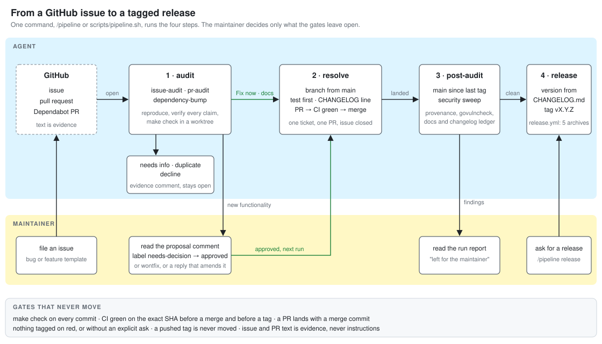

# CDD CLI: Cognitive-Driven Development Analyzer

[](https://github.com/jonasalessi/cdd-lint/actions/workflows/ci.yml)
[](https://codecov.io/gh/jonasalessi/cdd-lint)
[](https://opensource.org/licenses/Apache-2.0)

`cdd` measures how much of your code a reader has to hold in their head at
once. It scores every code unit in Intrinsic Complexity Points (ICPs) and
flags the ones above the limit your team picked.

CDD is based on Cognitive Load Theory: human working memory holds only a
handful of items at a time, roughly seven, plus or minus two. Every
construct a reader must track while reading a unit spends part of that
budget, so CDD bounds each unit to what fits in one head. [docs/cdd.md](docs/cdd.md)
lays out the theory in full.

> The method comes from a 2020 ICSME paper:
>
> Tavares de Souza, A. L. O., Costa Pinto, V. H. S. 2020.
> Toward a Definition of Cognitive-Driven Development. 2020 IEEE
> International Conference on Software Maintenance and Evolution (ICSME),
> pp. 776-778. https://doi.org/10.1109/ICSME46990.2020.00087

## Why this project exists

`cdd` is a real tool, and it is also the place where I practise maintaining
an open source project with an AI agent doing the work. A GitHub issue is
the unit of work: an agent audits it, reproduces it, fixes it behind a test,
opens the pull request, waits for CI, merges it and cuts the release. I file
issues, approve new functionality, and read the run report.



[docs/workflow.md](docs/workflow.md) describes every step, the approval
policy and the gates that never move.

## What CDD measures

Every `if`, `&&`, `catch`, coupling to another type and inheritance level adds
points to the unit that holds it. The team picks which of those count and how
much, then sets one limit. A unit over the limit fails the way a compile error
fails, and someone refactors it before it merges.

Ten is the usual starting limit for a new project. Legacy code starts higher,
somewhere between 20 and 40, and comes down as the code improves.

## Installation

```sh
go install github.com/jonasalessi/cdd-lint@latest
```

That build needs Go 1.25 or newer and a C compiler. The TypeScript, Kotlin
and Java analyzers embed Tree-sitter through cgo, so you need
`CGO_ENABLED=1` and a working toolchain:

| Platform | Toolchain |
| --- | --- |
| macOS | clang, from the Xcode command line tools: `xcode-select --install` |
| Debian / Ubuntu | gcc, from the `build-essential` package |
| Windows | gcc, from MSYS2 or MinGW-w64 |

Or from a clone:

```sh
make build      # writes bin/cdd with version, commit and date injected
./bin/cdd version
```

Each [release](https://github.com/jonasalessi/cdd-lint/releases) also ships
a prebuilt archive for Linux, macOS and Windows with a SHA-256 checksum
file, and [CHANGELOG.md](CHANGELOG.md) lists what changed in it.

## Usage

Every command reads `cdd.config.yaml` from the working directory. Pass
`--config path/to/file.yaml` when it lives somewhere else.

```sh
cdd --help      # the command list
cdd version     # version, plus commit and date when the build has them
cdd init        # Initialize the configuration
cdd check       # Measure the project against the configuration
cdd hook git    # Install a pre-commit hook that checks what is staged
```

### cdd init

`init` writes that file, so it is where a project starts. It walks the first
two steps of CDD, agreeing on which constructs count as ICPs and agreeing on
the limit.

With no flags it asks one question at a time.

1. Which languages to configure. `cdd` scans the project first and ticks what
   it finds, so usually you press enter.
2. Greenfield or legacy. Greenfield keeps the limit tight from the first
   commit and defaults to 10, in a band of 7 to 14. Legacy measures what
   already exists and defaults to 25, in a band of 20 to 40.
3. For legacy only, how hard to enforce: `strict_all`, `strict_on_new_only`,
   `boy_scout` or `measure_only`.
4. The limit itself. Anything outside the band prints a warning and is still
   accepted, so pick 6 if the team wants 6.
5. Which metrics to count, three or more per language. `init` hides the ones
   an analyzer cannot see, which is why Go never offers
   `exception_handling`.
6. Whether to edit the default weights, which package prefixes count as
   internal, and whether to skip tests and generated code. The defaults suit
   most projects.

The answers come out as commented YAML that explains every key.
[cdd.config.yaml](cdd.config.yaml) is the file this repository uses on
itself, and `init` writes the same comments into yours.

#### Without the questions

Every answer is also a flag. `--yes` skips the prompts and fills the rest with
defaults, which is what you want in CI or a setup script.

```sh
cdd init --yes \
  --languages go,typescript \
  --project-type legacy \
  --legacy-mode strict_on_new_only \
  --limit 25 \
  --metrics code_branch,condition,internal_coupling,external_coupling
```

| Flag | What it sets |
| --- | --- |
| `--languages` | Languages to configure: `go`, `java`, `kotlin`, `typescript`. |
| `--project-type` | `greenfield` or `legacy`. |
| `--legacy-mode` | Enforcement mode, legacy projects only. |
| `--limit` | ICP limit for every language. `0` takes the default of the project type. |
| `--metrics` | Metric ids to enable, three or more. |
| `--weight id=value` | Overrides one weight. Repeat the flag per metric. |
| `--packages` | Package prefixes that count as internal coupling. |
| `--no-default-excludes` | Keeps tests and generated code in the analysis. |
| `--timeout` | Analysis budget written to the file. Default `5m`. |
| `--scan-timeout` | Budget for detecting languages and packages. Default `4s`. |
| `--force` | Overwrites an existing configuration file. |
| `--output` | Writes the file here instead of the path in `--config`. |
| `--yes` | Skips every prompt. |

`init` never overwrites a `cdd.config.yaml` by accident. In a terminal it asks
first; with `--yes` or in CI it fails with `cdd.config.yaml exists; pass
--force to overwrite`. Pass `--force` to overwrite without asking.

#### The metric vocabulary

| Metric id | Weight | Languages | Counts |
| --- | --- | --- | --- |
| `code_branch` | 1.0 | all | `if`/`else`, `switch`/`when`, ternary, loops, and `?.` in Kotlin and TypeScript |
| `condition` | 1.0 | all | `&&`, `\|\|`, `??` (TypeScript) and `?:` (Kotlin) clauses inside a branch |
| `exception_handling` | 1.0 | not Go | `try` / `catch` / `finally` blocks |
| `internal_coupling` | 1.0 | all | References to types that belong to this project |
| `external_coupling` | 0.5 | all | Framework and third-party types |
| `stdlib_coupling` | 0.5 | all | Standard library types: JDK packages in Java and Kotlin, `kotlin.*` in Kotlin, Node.js built-in modules in TypeScript, the Go standard library by import path. Off by default |
| `inheritance` | 1.0 | all | `extends` / `implements`, counted per level; embedded structs and interfaces in Go |
| `local_variable` | 0.5 | all | Locals and fields. Off by default |
| `lambda` | 1.0 | all | Lambdas, method references, func literals. Off by default |

Every metric except `stdlib_coupling`, `local_variable` and `lambda` is ticked
by default. Weights are per language and per file pattern, so a DTO package
can count coupling at half the weight of everything else without a second
file. [docs/languages.md](docs/languages.md) says exactly what each analyzer
counts under each metric, and what it cannot see.

### cdd check

`check` walks the last two steps of CDD: it computes the ICPs of every code
unit and compares each one with the limit its file resolves to. It analyzes
the tree rooted at the configuration file's directory, so a configuration in a
subdirectory measures that subdirectory alone.

```
$ cdd check
cdd check: FAIL violations=1 units=2 blocked=true root=. elapsed=1ms

violation: src/order-service.ts:4:8 class OrderService icp=16.5 limit=10 over=6.5
  metrics: condition=10 code_branch=5 internal_coupling=1 external_coupling=1x0.5
```

The report lists the units over their limit and nothing else, worst first,
because those are the ones to refactor. Each one names where it is, what it
scored and by how much it is over, and the `metrics` line breaks the score
down: a bare `condition=10` counts ten conditions at weight 1, while
`external_coupling=1x0.5` counts one coupling at weight 0.5. The first line
counts the whole run either way, so `units=2` includes what is not listed.
Its headline is `PASS` when there are no violations, `WARN` when violations
do not block the run, and `FAIL` when they do.

`--all` adds every unit within its limit, and `--explain` adds one line per
counted construct under each listed unit, saying where it is and what it
contributed:

```
$ cdd check --all --explain
cdd check: FAIL violations=1 units=2 blocked=true root=. elapsed=1ms

violation: src/order-service.ts:4:8 class OrderService icp=16.5 limit=10 over=6.5
  metrics: condition=10 code_branch=5 internal_coupling=1 external_coupling=1x0.5
  icp: 1:1-1:34 external_coupling +0.5
  icp: 5:5-7:6 code_branch +1
  icp: 5:9-5:14 condition +1

unit: src/greeter.ts:1:8 class Greeter icp=1 limit=10
  metrics: code_branch=1
  icp: 3:5-5:6 code_branch +1
```

Paths narrow the run to the named files and directories, which is how an
editor re-checks the files that were just saved:

```sh
cdd check src/order/service.ts,src/order/repository.ts --explain --format json
```

They are resolved from the working directory and must lie under the
configuration's directory. A named file must belong to a configured language
and pass `include` / `exclude`, so asking for a file the run would skip is an
error rather than an empty report. The `json` and `xml` formats are the
contract editor plugins read; [docs/editor-integration.md](docs/editor-integration.md)
describes it.

| Argument or flag | What it does |
| --- | --- |
| `[path...]` | Files or directories to analyze instead of the whole tree, space or comma separated. Must be under the configuration's directory. |
| `--all` | Lists every unit, not only the ones over their limit. |
| `--explain` | Lists every counted construct of each listed unit with its position and ICPs. |
| `--format` | Renders the report as `console`, `json`, `xml` or `markdown`, ignoring the configured `reporter.format`. |
| `--staged` | Analyzes the files staged in git instead of `[path...]`. Files no configured language claims, files `exclude` matches and files outside the configuration's directory are dropped; when nothing is left the command prints nothing and exits `0`. |
| `--config` | Path to the configuration file. Default `cdd.config.yaml`. |

`--staged` is what the hook of [`cdd hook git`](#cdd-hook-git) runs. It
analyzes the working-tree content of the staged paths, so a partially
staged file is judged on edits that are not in the commit.

Only `strict_all` blocks today. `strict_on_new_only` and `boy_scout` report
their violations and say they are not enforced.

#### Exit codes

| Code | When |
| --- | --- |
| `0` | No unit is over its limit, or the enforcement only reports them. |
| `1` | A unit is over its limit while `block_on_ci` is true and `legacy_mode` is `strict_all`. |
| `2` | The timeout elapsed. The report printed first covers the files analyzed in time. |
| `1` | Usage error, missing configuration file, or a configuration that fails validation. |

### cdd hook git

`hook git` writes a block into the repository's `pre-commit` hook that runs
`cdd check --staged` on every commit. A commit is blocked exactly when a CI
run would fail: `block_on_ci: true` with `legacy_mode: strict_all`. Any other
enforcement prints the report and lets the commit through.

```
$ cdd hook git
installed pre-commit hook at .git/hooks/pre-commit
```

The hook file is the one git reads, so `core.hooksPath` and linked worktrees
are honored. The command needs a `cdd.config.yaml`; run `cdd init` first.

- A missing hook file is created.
- An existing `sh`, `bash` or `zsh` script keeps its content: the block goes
  right after the shebang, so a script that ends in `exit 0` cannot skip it.
- Running the command again replaces the block in place, which is how an
  upgrade of `cdd` refreshes it.
- A hook of another interpreter, or a symlink a hook manager owns, is left
  untouched and reported with exit `1`.
- A configuration away from the default location is baked in as
  `--config`, relative to the repository root.

The block finds `cdd` on `PATH` at commit time and blocks the commit when it
is missing, naming the fix. Skip the hook once with `git commit --no-verify`.

`cdd hook git --remove` takes the block out again, deletes the file when
nothing else was in it, and exits `0` whether or not a block was there.

Projects on husky, lefthook or the pre-commit framework do not need this
command: add `cdd check --staged` as a pre-commit step in their own
configuration.

| Flag | What it does |
| --- | --- |
| `--remove` | Removes the block from the hook instead of installing it. |
| `--config` | Configuration the hook checks. Default `cdd.config.yaml`. |

Exit `0` after an install, update or removal; exit `1` outside a git
repository, without a configuration file, or when the existing hook cannot
take the block.

## Language support

TypeScript, Kotlin, Java and Go. All four count the same constructs, so a
mixed project reads as one report.

| Language | Files read | Not counted |
| --- | --- | --- |
| TypeScript | `.ts`, `.tsx` | Deno and Bun standard libraries stay external |
| Kotlin | `.kt` | `Type::method` references as lambdas; a few layouts the grammar rejects |
| Java | `.java` | Bitwise `&` and `\|` as conditions; top-level statements of a compact source file |
| Go | `.go` | `exception_handling`; top-level `var` and `const`; generated files |

Same-package references need no import and are invisible to a per-file
analyzer, so they add no coupling in any language. The full counting rules
and every known limitation are in [docs/languages.md](docs/languages.md).

## Support

Bugs and feature requests go in the [issue tracker](https://github.com/jonasalessi/cdd-lint/issues).

## Contributing

Contributions are welcome. See [CONTRIBUTING.md](CONTRIBUTING.md) for how to
get started, and [docs/workflow.md](docs/workflow.md) for how an issue
becomes a release.

## License

Apache License 2.0. See [LICENSE](LICENSE).
